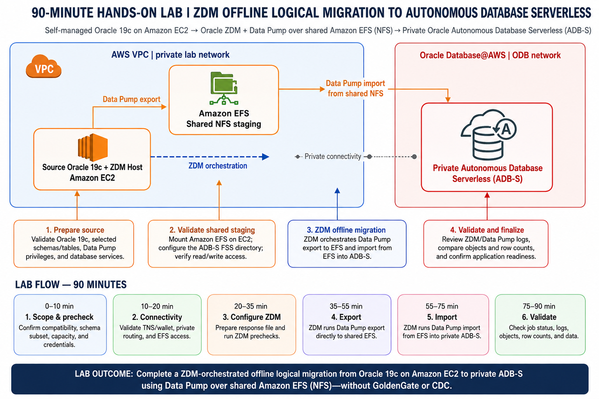

# MultiCloud AWS Database Migration with Oracle ZDM and Shared Amazon EFS

## Introduction

Move a selected Oracle Database 19c workload from Amazon EC2 to private Autonomous Database Serverless on Oracle Database@AWS. Oracle Zero Downtime Migration 26.1 orchestrates the offline logical migration through Oracle Data Pump. Amazon EFS provides shared NFS staging. The dump set does not move through Amazon S3.

This workshop uses the validated scope `FINANCE.RISK_AUDIT_ARCHIVE`. The maximum requested scope is 20 GiB. The source allocation is 16.551 GiB, and the table contains 400,000 rows. The migration does not use GoldenGate, change data capture, or manually executed `expdp` and `impdp` commands. Stop application writes or place the workload in read-only mode before the final export. Redirect traffic only after target validation succeeds.

### Prerequisites

- Access to the pre-provisioned source and ZDM EC2 host in `us-east-1`.
- A private Autonomous Database Serverless target in the Oracle Database@AWS ODB network.
- The VPC route to the ODB client CIDR and the return route to the EC2 subnet.
- EFS security rules that allow TCP 2049 from the EC2 source security group and the ODB client CIDR.
- DNS resolution for `efs.zdm.internal` from the EC2 host and the target database.
- Source and target wallets stored outside the workshop package. Passwords and wallet contents are intentionally omitted.
- The target `FINANCE` owner provisioned with a bounded 25 GiB DATA quota and only `CREATE SESSION` plus `CREATE TABLE`, or permission to complete that prerequisite when ZDM reports `PRGZ-1391`.
- `sqlplus`, `zdmcli`, and the AWS CLI available in the lab environment.

### Objectives

- Confirm the private network, database, and shared NFS staging prerequisites.
- Mount Amazon EFS on the source/ZDM EC2 host and attach the same file system to the private Autonomous Database Serverless target.
- Prepare and evaluate a ZDM 26.1 `OFFLINE_LOGICAL` migration using NFS and table mode.
- Execute the migration, monitor ZDM and Data Pump evidence, and validate the source and target independently.

Estimated Workshop Time: 90 minutes

## Acknowledgements

* **Author** - Workshop team
* **Last Updated By/Date** - Workshop team / September 8, 2026
